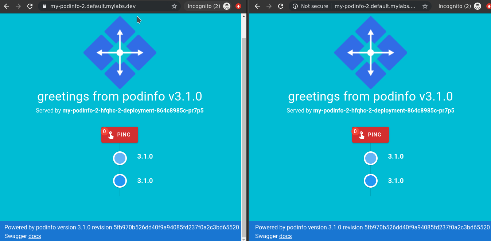

# Knative operations

Create service `my-podinfo-2` with image:

```bash
kn service create my-podinfo-2 --port 9898 --image harbor.mylabs.dev/library/my-podinfo:3.1.0
sleep 30
```

Output:

```text
Creating service 'my-podinfo-2' in namespace 'default':

  0.205s The Route is still working to reflect the latest desired specification.
  0.230s Configuration "my-podinfo-2" is waiting for a Revision to become ready.
  7.132s ...
  7.417s Ingress has not yet been reconciled.
  9.415s Ready to serve.

Service 'my-podinfo-2' created with latest revision 'my-podinfo-2-fzhhd-1' and URL:
http://my-podinfo-2.default.mylabs.dev
```

Check if the application is really working:

```bash
curl -k http://my-podinfo-2.default.mylabs.dev https://my-podinfo-2.default.mylabs.dev
```

Output:

```json
{
  "hostname": "my-podinfo-2-fzhhd-1-deployment-566757c497-xvc2m",
  "version": "3.1.0",
  "revision": "5fb970b526dd40f9a94085fd237f0a2c3bd65520",
  "color": "blue",
  "message": "greetings from podinfo v3.1.0",
  "goos": "linux",
  "goarch": "amd64",
  "runtime": "go1.12.14",
  "num_goroutine": "6",
  "num_cpu": "2"
}{
  "hostname": "my-podinfo-2-fzhhd-1-deployment-566757c497-xvc2m",
  "version": "3.1.0",
  "revision": "5fb970b526dd40f9a94085fd237f0a2c3bd65520",
  "color": "blue",
  "message": "greetings from podinfo v3.1.0",
  "goos": "linux",
  "goarch": "amd64",
  "runtime": "go1.12.14",
  "num_goroutine": "6",
  "num_cpu": "2"
}
```

Set hard limit of concurrent requests to be processed by a single replica:

```bash
kn service update my-podinfo-2 --concurrency-limit=1
```

Output:

```text
Updating Service 'my-podinfo-2' in namespace 'default':

  3.050s Traffic is not yet migrated to the latest revision.
  3.104s Ingress has not yet been reconciled.
  4.689s Ready to serve.

Service 'my-podinfo-2' updated with latest revision 'my-podinfo-2-hfqhc-2' and URL:
http://my-podinfo-2.default.mylabs.dev
```

Check the pods:

```bash
kubectl get pods
```

Output:

```text
NAME                                                                         READY   STATUS      RESTARTS   AGE
my-podinfo-2-fzhhd-1-deployment-566757c497-xvc2m                             2/2     Running     0          48s
my-podinfo-2-hfqhc-2-deployment-864c8985c-jz59h                              2/2     Running     0          5s
my-podinfo-build-docker-image-from-git-pipelinerun-build--msbcv-pod-d6861e   0/6     Completed   0          22m
```


